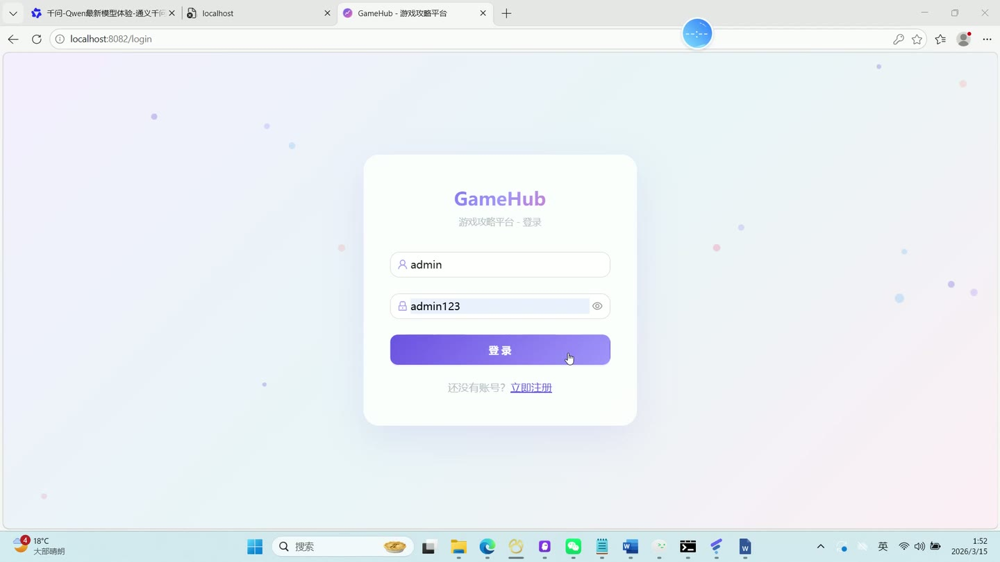
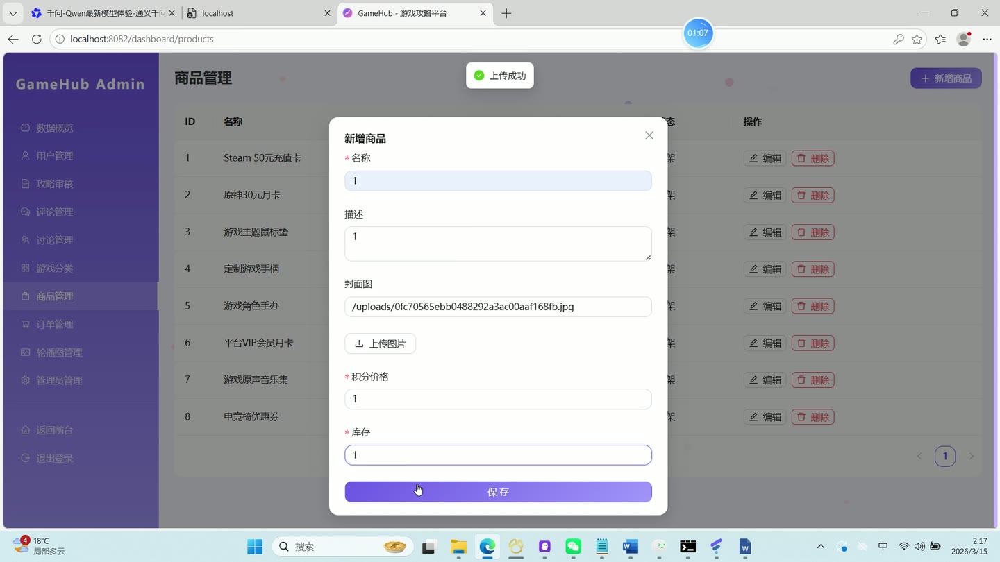
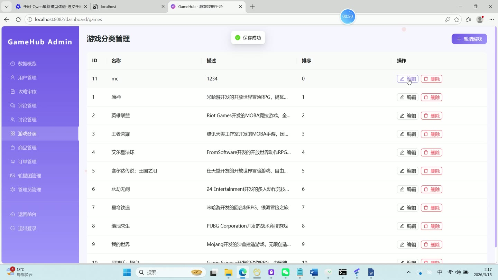
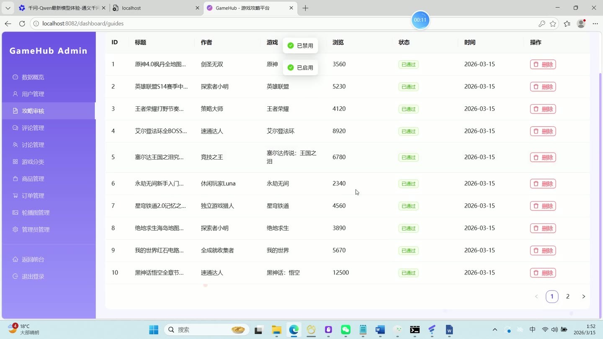
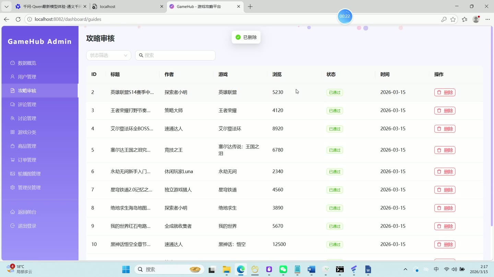
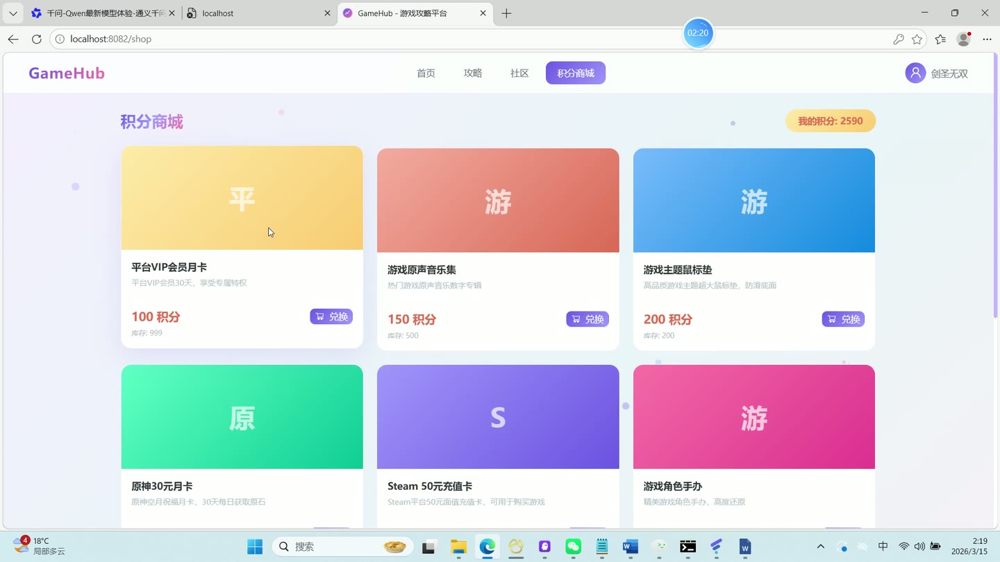

# (附文档)Springboot3+MySQL+React 游戏攻略平台

**技术栈**：Springboot3、React18、MySQL

### 系统简介

GameHub 是一款基于 Spring Boot 3 + React 18 前后端分离的游戏攻略平台。系统支持普通用户、管理员两种角色，提供攻略发布与审核、社区讨论、积分商城、私信聊天、个人中心等完整功能。采用 JWT 认证、MyBatis-Plus 分页、文件上传等技术，适合作为游戏社区类项目的完整参考实现。
 
### 核心功能
 
### 普通用户端

 
- 注册/登录：填写用户名、密码、昵称完成注册，登录后自动获取 JWT Token 并跳转首页或后台 
- 浏览攻略列表：支持按游戏分类筛选、关键词搜索标题/内容，分页展示攻略卡片 
- 查看攻略详情：展示标题、内容、封面、作者信息、游戏名称，自动增加浏览量，显示点赞/收藏状态 
- 发布攻略：填写标题、内容、封面图片、关联游戏，提交后状态为待审核，发布获得 50 积分 
- 编辑攻略：修改已发布的攻略标题、内容、封面、游戏，重新提交后进入待审核状态 
- 点赞/取消点赞攻略：点击点赞按钮切换状态，点赞后攻略点赞数 +1，用户获得 2 积分 
- 收藏/取消收藏攻略：点击收藏按钮切换状态，收藏后攻略收藏数 +1 
- 发表评论：在攻略详情页输入评论内容，提交后评论数 +1，用户获得 5 积分 
- 查看评论列表：按时间倒序展示顶级评论，每条评论下可查看回复列表 
- 浏览社区讨论：按游戏分类筛选帖子列表，展示标题、作者、回复数、游戏名称 
- 发布讨论帖：填写标题、内容、关联游戏，发布后状态为已通过 
- 回复讨论帖：在帖子详情页输入回复内容，回复后帖子回复数 +1 
- 查看积分商城：分页展示上架商品（名称、描述、封面、积分价格、库存） 
- 兑换商品：选择商品提交兑换，扣除对应积分并扣减库存，生成兑换订单 
- 查看兑换订单：分页展示个人兑换记录，包含订单号、商品名称、消耗积分、状态 
- 查看积分记录：分页展示个人积分变动明细（类型、数额、描述、时间） 
- 发送私信：选择接收用户，输入内容发送私信，消息状态为未读 
- 查看会话列表：按最新消息时间排序展示所有对话，显示对方昵称、头像、最后消息 
- 查看聊天记录：进入会话后按时间正序展示全部消息，自动将对方未读消息标记为已读 
- 查看未读消息数：顶部展示未读私信数量 
- 个人中心：查看/编辑昵称、邮箱、手机号、性别、个人简介、头像 
- 修改密码：输入原密码、新密码完成密码修改 
- 查看他人主页：通过用户 ID 查看对方昵称、头像、等级等公开信息 
- 每日登录奖励：每天首次登录自动获得 10 积分，记录积分来源为"每日登录奖励"
 
### 管理员端

 
- 查看仪表盘：展示用户总数、攻略总数、评论总数、讨论帖总数、待审核攻略数、订单总数 
- 用户管理：分页查看用户列表，支持按用户名/昵称搜索，可启用/禁用用户账号 
- 管理员管理：新增管理员（设置用户名、密码、昵称、邮箱），编辑管理员信息，删除非超级管理员 
- 攻略审核：分页查看所有攻略，支持按状态筛选和关键词搜索，审核通过/驳回攻略，删除攻略（同时删除关联的评论、点赞、收藏） 
- 评论管理：分页查看所有评论，可启用/禁用评论，删除违规评论 
- 讨论管理：分页查看所有讨论帖，可启用/禁用帖子，删除帖子下的回复 
- 游戏分类管理：新增/编辑游戏分类（名称、图标、封面、描述、排序），删除分类（如有攻略引用则禁止删除） 
- 商品管理：分页查看积分商品，新增/编辑商品（名称、描述、封面、积分价格、库存），删除商品 
- 订单管理：分页查看所有兑换订单，可修改订单状态（待处理/已完成等） 
- 轮播图管理：查看轮播图列表（按排序字段升序），新增/编辑/删除轮播图（标题、图片、链接、排序、状态）
 
### 技术栈

  后端框架 Spring Boot 3.2   ORM MyBatis-Plus 3.5.5   权限认证 Spring Security 6 + JWT（jjwt 0.12.5）   前端框架 React 18 + React Router 6   UI 组件库 Ant Design 5   状态管理 React Context（AuthContext）   构建工具 Vite 5   数据库 MySQL 8 + MyBatis-Plus 分页插件   文件上传 MultipartFile + 本地存储 
 
### 交付内容

 
- 后端完整源码 
- 前端完整源码 
- 数据库初始化脚本 
- 万字文档

## 界面展示

---

## 获取完整源码 + 万字文档

本仓库为项目介绍页。**完整前后端源码、数据库初始化脚本、万字项目文档**，请加微信 `kangkangcode`，或访问 [codekk.top](http://codekk.top) 获取。

可作课程设计 / 毕业设计参考，支持远程部署调试。